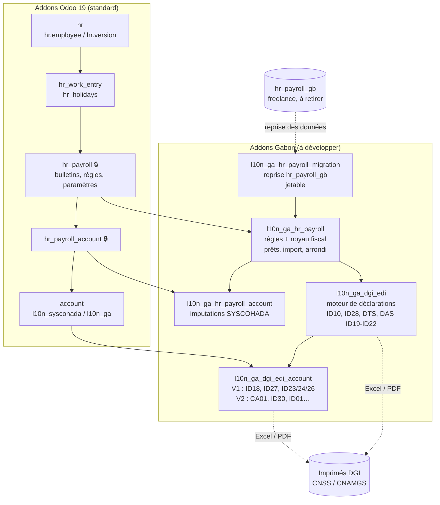

# Architecture logicielle — Addon « Paie Gabon & déclarations DGI » (Odoo 19 Enterprise)

Version 1.1 — 23/09/2026 (mise à jour après le benchmark `hr_payroll_gb` / V1, voir fichiers 07 et 08). Ce dossier s'appuie sur la base de connaissance fiscale (dossier `base_connaissance_fiscale_gabon`) et sur une lecture du code source Odoo 19.0 Community (modules `hr`, `hr_work_entry`, `hr_holidays`, `account`, `l10n_ga`, `l10n_syscohada`). Le module `hr_payroll` d'Odoo Enterprise est dans un dépôt privé : les points qui en dépendent sont signalés « 🔒 à vérifier sur le code Enterprise ».

## Sommaire

| Fichier | Contenu |
|---|---|
| `01_architecture_systeme.md` | Contexte (C4 niveau 1), conteneurs, découpage en 4 modules, couches internes, déploiement |
| `02_uml.md` | Cas d'utilisation, diagramme de classes, séquences (bulletin, clôture mensuelle ID10, DAS), états, activités |
| `03_mcd_mld.md` | Merise : dictionnaire de données, règles de gestion, MCD, MLD, correspondance avec les modèles Odoo (MPD) |
| `04_design_patterns.md` | 11 patrons retenus, le problème qu'ils règlent et leur squelette de code Odoo |
| `05_integration_odoo.md` | Points d'extension exacts dans les addons Odoo 19 (héritages, champs, méthodes, xml_id, sécurité, manifestes) |
| `06_structure_code_et_roadmap.md` | Arborescence des modules, conventions, stratégie de tests, CI, feuille de route V1 → V2 |
| `07_benchmark_hr_payroll_gb_vs_v2.md` | Benchmark du module freelance `hr_payroll_gb`, de la V1 `l10n_ga_dgi_edi` et de la conception V2 (document du Projet) |
| `08_evolutions_post_benchmark.md` | Les 14 fonctionnalités ajoutées après le benchmark (F1 à F14), leur conception et leurs impacts |

## Décisions d'architecture (ADR résumés)

| N° | Décision | Pourquoi |
|---|---|---|
| ADR-01 | S'appuyer sur `hr_payroll` Enterprise pour le cycle du bulletin (lots, bulletins, règles, comptabilisation) au lieu de réécrire un moteur de paie | Le client est en Enterprise ; `hr_payroll` fournit déjà lots, bulletins, règles, `hr.rule.parameter` datés et `hr_payroll_account` |
| ADR-02 | Découper en 4 modules : `l10n_ga_hr_payroll`, `l10n_ga_hr_payroll_account`, `l10n_ga_dgi_edi`, `l10n_ga_dgi_edi_account` | Installer la paie sans les déclarations, et les déclarations comptables (V2) sans toucher la paie ; suit le modèle des localisations Odoo (`l10n_xx_hr_payroll`, `l10n_xx_hr_payroll_account`) |
| ADR-03 | Isoler le calcul fiscal dans un **noyau Python pur** (`ga_fiscal_core`, sans import `odoo`) appelé par les règles salariales | Tester le calcul IRPP/TCS/CNSS en millisecondes sans base de données ; réutiliser le calculateur de référence déjà validé |
| ADR-04 | Tous les taux, plafonds et barèmes dans `hr.rule.parameter` (valeurs datées) chargés depuis `parametres_fiscaux_gabon_2026.yaml` | 3 changements de taux en 2026 ; recalcul rétroactif possible ; aucun taux en dur |
| ADR-05 | Données personnelles fiscales (enfants, parts, n° CNSS, NIF) portées par `hr.version` | En Odoo 19, `hr.employee` hérite par délégation de `hr.version` (`_inherits`) : les données historisées vivent sur la version, donc le nombre de parts est daté automatiquement |
| ADR-06 | Une déclaration = un enregistrement `l10n_ga.declaration` **figé** à la validation (instantané des cases et du détail) | Une déclaration déposée ne doit jamais changer si un bulletin est modifié après coup ; traçabilité pour contrôle fiscal |
| ADR-07 | Moteur de déclarations générique : un type d'imprimé = une définition de cases (données) + une stratégie de collecte (code) + un rendu Excel et PDF | Ajouter un imprimé (ID28, DTS, CA01…) sans toucher au moteur |
| ADR-08 | Sorties Excel (`xlsxwriter`) et PDF (QWeb) uniquement, aucune génération XML | Exigence client ; les portails DGI/CNSS acceptent la saisie ou les fichiers |
| ADR-09 | Déclarations comptables V2 (CA01, ID18, ID27…) lues dans la comptabilité (`account.report` de `l10n_ga`, lignes d'écritures, taxes) plutôt que recalculées | `l10n_ga` fournit déjà un rapport TVA structuré comme la CA01 et des taxes groupées TVA + CSS |
| ADR-10 | Déclenchement par événements ORM (validation d'un lot de paie, d'un paiement) et par `ir.cron` (échéancier), jamais par saisie | Exigence « génération automatique sans intervention humaine » |
| ADR-11 | Ne pas prendre `hr_payroll_gb` comme socle ; en reprendre les données métier (nomenclature des primes, types de congés, prêts, champs société) | Benchmark : 15/55, 3 défauts bloquants (NET écrasé, absences non déduites, déclarations sur bulletins brouillons), taux non datés, aucun test |
| ADR-12 | Garder le nom technique `l10n_ga_dgi_edi` pour la V2 et migrer ses données par scripts `migrations/19.0.2.0.0/` | La V1 est en production : on conserve l'historique des déclarations déposées, les classeurs officiels et les 11 fichiers de tests |
| ADR-13 | DAS complète (ID19 à ID26) et retenues fournisseurs (ID18, ID27) dès la V1.0 ; seul le reste de la comptabilité (CA01, IS, patente, CFU, loyers) reste en V2.0 | La V1 existante les produit déjà : ne pas régresser pendant plusieurs mois |
| ADR-14 | Un module de reprise jetable `l10n_ga_hr_payroll_migration` avec cumuls d'ouverture `l10n_ga.ytd.opening` | La bascule se fera en cours d'année : la régularisation IRPP, le plafond des gratifications et la DAS ont besoin des cumuls antérieurs |
| ADR-15 | Le mode de paiement n'agit que sur l'arrondi, jamais sur la règle `NET` (unique) ; le reliquat d'arrondi est stocké sur le bulletin | Correction du défaut B1 du freelance (deux règles `NET` au même identifiant) |
| ADR-16 | Indemnités contractuelles en lignes datées `hr.salary.attachment` (type d'entrée + règle `GA_*`), jamais un champ par rubrique | Sprint 0 point 9 : le modèle accepte les gains ; historique natif (`docs/adr/ADR-16-*.md`) |
| ADR-17 | Exonérations par ligne dans le noyau, plafonds par groupe via registres `SOCIAL_CAPS` / `TAX_CAPS` | Plafonds partagés entre rubriques ; justification ligne à ligne (`docs/adr/ADR-17-*.md`) |
| ADR-18 | `l10n_ga.check.issue` défini dans `l10n_ga_hr_payroll`, étendu par `l10n_ga_dgi_edi` ; bloquants relayés par `_get_errors_by_slip` | Règle de dépendance `01` §3 ; mécanisme natif d'anomalies d'Odoo 19 (`docs/adr/ADR-18-*.md`) |
| ADR-19 | Points d'accroche Enterprise 19 : états `validated/paid`, Observer sur `hr.payslip.action_payslip_done`, bulletin figé avant `super()`, comptes par société via `_configure_payroll_account_ga`, règle courante exposée | Sprint 0 points 3, 4, 12, 13 (`docs/adr/ADR-19-*.md`, `docs/sprint0_verifications_enterprise.md`) |

## Vue d'ensemble en une image

