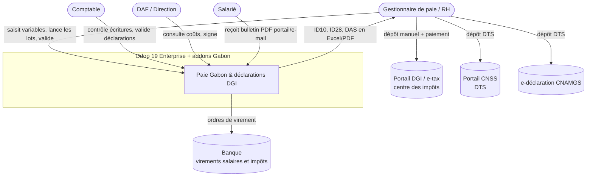
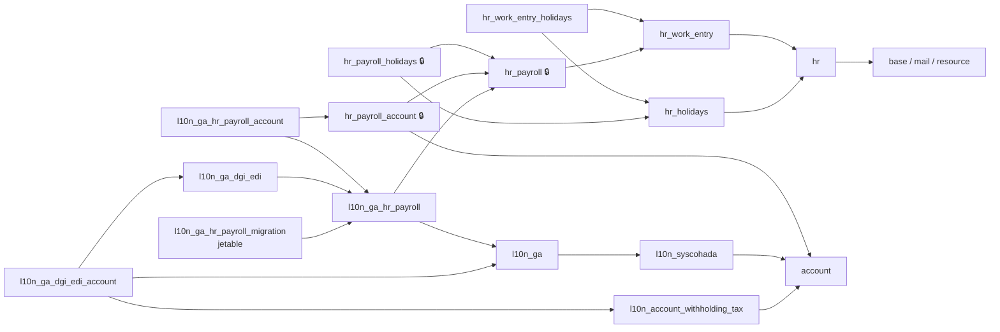
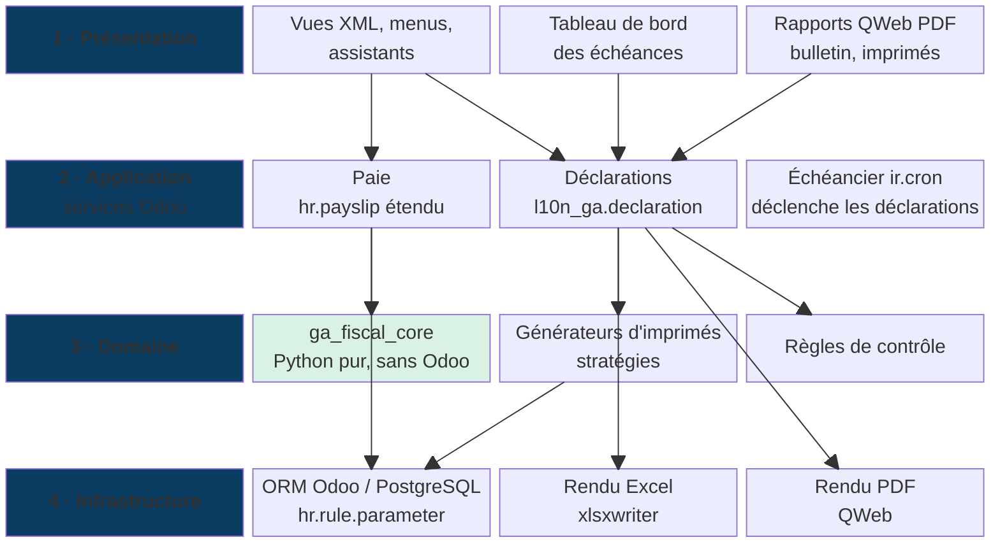
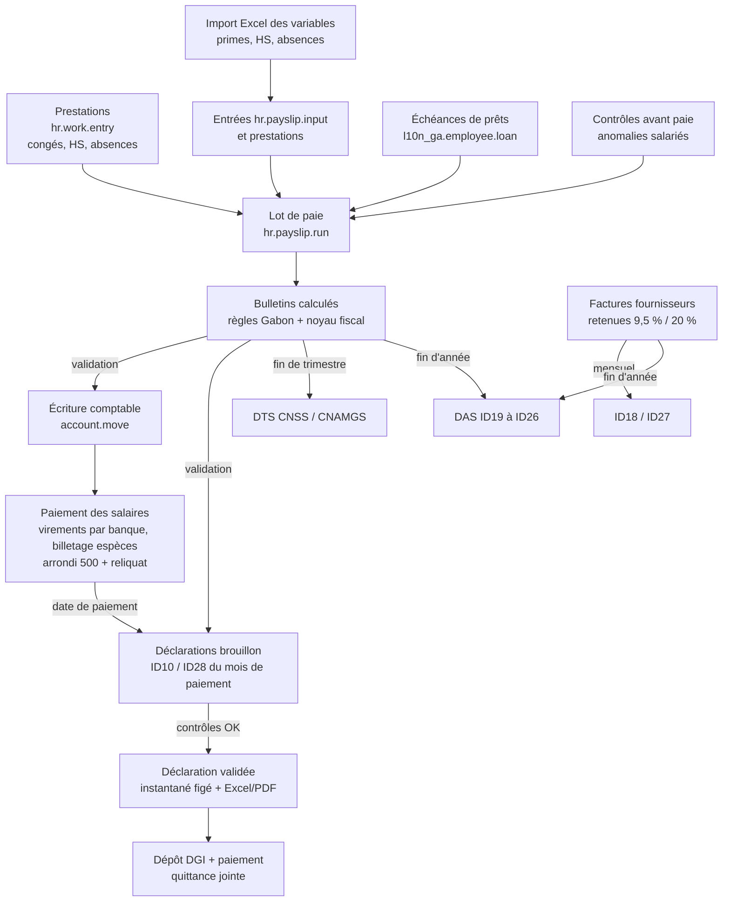
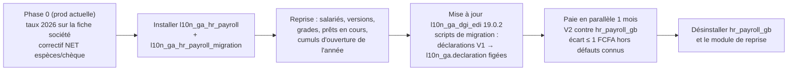

# 01 — Architecture système

## 1. Contexte (C4 niveau 1)

Qui utilise l'addon, et avec quels systèmes externes il échange. L'addon ne se connecte à aucun portail administratif : il produit des fichiers que le gestionnaire dépose (ADR-08).

## 2. Conteneurs (C4 niveau 2)

| Conteneur | Technologie | Rôle pour l'addon |
|---|---|---|
| Serveur Odoo | Python 3.12, Odoo 19 Enterprise, workers HTTP | Calcul des bulletins, écrans, génération des fichiers |
| Workers cron | Odoo `ir.cron` | Échéancier fiscal (création des déclarations brouillon J-10, rappels), recalcul des contrôles |
| PostgreSQL | PostgreSQL 15+ | Bulletins, lignes, déclarations figées, paramètres |
| Filestore | `ir.attachment` | Fichiers Excel/PDF générés, joints à la déclaration (preuve de dépôt, quittance scannée) |
| Moteur de rendu PDF | wkhtmltopdf (QWeb) | Bulletins et imprimés PDF |
| Bibliothèque Excel | `xlsxwriter` (livrée avec Odoo) | Imprimés Excel fidèles aux modèles DGI |

## 3. Découpage en modules et dépendances

| Module | Dépend de | Auto-install | Contenu |
|---|---|---|---|
| `l10n_ga_hr_payroll` | `hr_payroll`, `l10n_ga` | non | Champs Gabon sur `hr.version` et `res.company`, type et structure de paie « Gabon — Employé », catalogue des ~60 rubriques, paramètres datés, types d'entrée, 12 types d'absences et congés, conventions collectives, grilles et taux d'heures sup, noyau fiscal `ga_fiscal_core`, **prêts salariés**, **modes de paiement et arrondi espèces**, **import Excel des variables**, **contrôles avant paie**, bulletin PDF figé, livre de paie, états de virement et de billetage, tests |
| `l10n_ga_hr_payroll_account` | `l10n_ga_hr_payroll`, `hr_payroll_account` | oui | Comptes SYSCOHADA sur les règles (`pcg_6611`, `pcg_6641`, `pcg_422`, `pcg_4313`, `pcg_4472`…), journal de paie, rapprochements |
| `l10n_ga_dgi_edi` (V2 du module existant) | `l10n_ga_hr_payroll` | non | Moteur de déclarations (types, cases, déclarations figées, détails, contrôles, quittances multiples, échéancier), imprimés sociaux et sur salaires : ID10, ID28, DTS CNSS et CNAMGS, DAS ID19 à ID22, écran « Contrôle DAS », classeurs officiels `.xlsm`, scripts de migration des déclarations V1 |
| `l10n_ga_dgi_edi_account` | `l10n_ga_dgi_edi`, `l10n_ga`, `l10n_account_withholding_tax` | non | **V1.0** : classement des bénéficiaires (`res.partner`), retenues 9,5 % et 20 %, ID18, ID27, annexes DAS ID23, ID24, ID26. **V2.0** : CA01/CA02, ID30, ID09, ID31, ID01/ID02/ID03, patente, CFU |
| `l10n_ga_hr_payroll_migration` (jetable) | `l10n_ga_hr_payroll` | non | Reprise depuis `hr_payroll_gb` : table de correspondance des codes, salariés et versions, grades, prêts en cours, cumuls d'ouverture de l'année, rapport de rapprochement ; désinstallé après la bascule |

Règle de dépendance : aucun module Gabon ne dépend d'un module « plus haut » ; `l10n_ga_dgi_edi` ne lit que la paie, tout ce qui vient des factures fournisseurs passe par `l10n_ga_dgi_edi_account`. La V1.0 livre donc la paie, les déclarations sur salaires et la DAS complète ; la V2.0 ajoute les déclarations issues du reste de la comptabilité. Aucun module ne dépend de `hr_payroll_gb` : seul le module de reprise en lit les tables, par SQL, pendant la bascule.

## 4. Couches internes (architecture hexagonale adaptée à Odoo)

Principe : le noyau `ga_fiscal_core` ne reçoit que des nombres et des paramètres (dataclasses), il ne lit jamais la base. Les règles salariales Odoo lui passent les montants du bulletin et les paramètres datés, puis écrivent le résultat. Cela rend le calcul testable hors Odoo avec les exemples de la base de connaissance (fichier 04 §8).

## 5. Flux de données mensuel

## 6. Déploiement

| Environnement | Contenu | Remarques |
|---|---|---|
| Odoo.sh (recommandé) ou serveur on-premise | Branches `production`, `staging`, `dev` | Les modules Gabon dans un dépôt Git privé ajouté comme sous-module |
| Staging | Copie anonymisée de la production | Recette des changements de taux avant la date d'effet |
| Sauvegardes | Quotidiennes + avant chaque mise à jour de paramètres | Les déclarations figées et leurs pièces jointes font foi en cas de contrôle (conservation 10 ans) |

Sécurité : groupes `hr_payroll.group_hr_payroll_user` / `group_hr_payroll_manager` 🔒 réutilisés ; nouveau groupe « Déclarant fiscal » pour valider et marquer déposée une déclaration ; règles multi-société sur toutes les nouvelles tables ; les montants de salaire restent invisibles aux groupes non paie.

## 7. Bascule depuis `hr_payroll_gb` et la V1

La V2 remplace en production le module freelance `hr_payroll_gb` et la V1 de `l10n_ga_dgi_edi`. La bascule se fait en début de mois, sur une copie de staging d'abord.

| Étape | Contrôle de sortie |
|---|---|
| Reprise | rapport de rapprochement : cumuls repris = cumuls des bulletins `hr_payroll_gb` de l'année, par salarié et par rubrique |
| Migration V1 | nombre de déclarations et montants par type identiques avant et après ; pièces jointes et quittances présentes |
| Paie parallèle | écarts expliqués uniquement par les défauts B1, B2, M3, M4 du benchmark |
