# 02 — Modélisation UML

Conventions : les classes préfixées `hr.` ou `account.` sont des modèles Odoo existants (étendus) ; les classes `l10n_ga.*` sont nouvelles ; `ga_fiscal_core` est le noyau Python pur. 🔒 = modèle Enterprise dont la structure exacte doit être vérifiée sur le code source Enterprise 19.0.

## 1. Diagrammes de cas d'utilisation

### 1.1 Paie

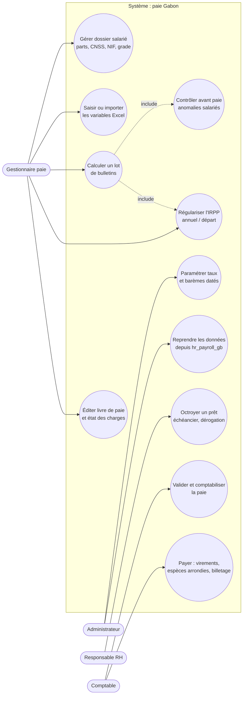

### 1.2 Déclarations

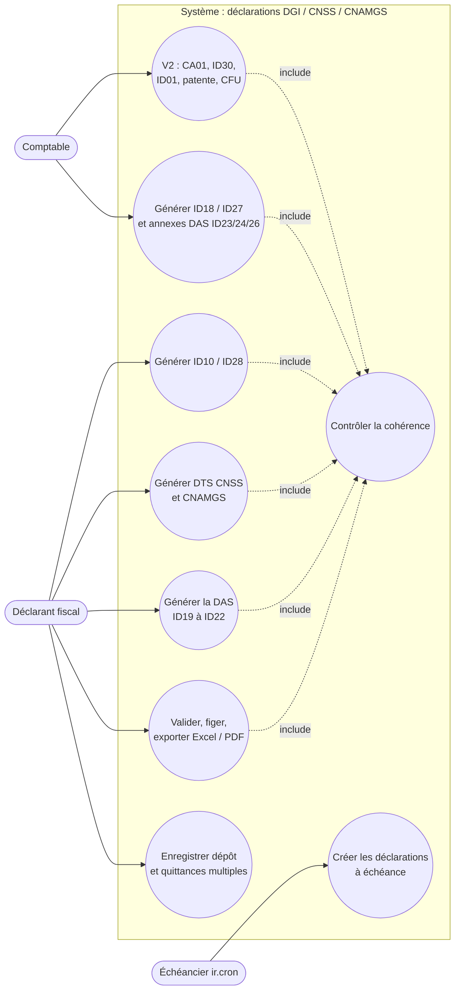

## 2. Diagramme de classes — domaine paie

```mermaid
classDiagram
  direction LR
  class HrEmployee["hr.employee"] {
    +version_id : hr.version
    +version_ids : hr.version[*]
    +_get_version(date) hr.version
  }
  class HrVersion["hr.version (étendu)"] {
    +date_version : Date
    +wage : Monetary
    +marital : Selection
    +children : Integer
    +ssnid : Char  « n° CNSS »
    +l10n_ga_cnamgs_number : Char
    +l10n_ga_nif : Char
    +l10n_ga_disabled_children : Integer
    +l10n_ga_extra_half_part : Boolean
    +l10n_ga_tax_parts : Float «calculé»
    +l10n_ga_tax_parts_forced : Float
    +l10n_ga_nationality_code : Selection «1..4»
    +l10n_ga_transport_trips : Selection «2|4»
    +l10n_ga_company_car : Boolean
    +l10n_ga_agreement_id : Many2one
    +l10n_ga_job_code / level_code : Char
    +l10n_ga_grade_id : Many2one
    +l10n_ga_payment_mode : Selection «virement|espèces|chèque»
    +_compute_l10n_ga_tax_parts()
  }
  class ResCompany["res.company (étendu)"] {
    +l10n_ga_nif : Char
    +l10n_ga_cnss_employer_number : Char
    +l10n_ga_cnamgs_employer_number : Char
    +l10n_ga_tax_center_code : Char
    +l10n_ga_taxpayer_segment : Selection «DGE|CIME|autre»
    +l10n_ga_cfp_on_id28 : Boolean
    +l10n_ga_fnh_employee_share : Float
    +l10n_ga_cash_rounding : Integer «500»
    +l10n_ga_loan_ceiling : Monetary
  }
  class Agreement["l10n_ga.collective.agreement"] {
    +name : Char
    +code : Char
    +seniority_start_years : Integer
    +seniority_rate_start : Float
    +seniority_rate_step : Float
    +seniority_rate_max : Float
  }
  class OvertimeRate["l10n_ga.overtime.rate"] {
    +agreement_id
    +work_entry_type_id
    +band_from_hour / band_to_hour : Float
    +period : Selection «jour|nuit|dimanche|férié»
    +rate : Float
  }
  class Payslip["hr.payslip 🔒 (étendu)"] {
    +employee_id / version_id
    +date_from / date_to
    +l10n_ga_payment_date : Date
    +l10n_ga_ytd_bonus_exempt : Monetary «calculé»
    +l10n_ga_tax_parts_used / bases / plafonds «figés»
    +l10n_ga_ytd_gross / taxable / irpp / tcs / cnss «figés»
    +l10n_ga_rounding_carry : Monetary
    +_l10n_ga_facts(categories) PayslipFacts
    +_l10n_ga_params() FiscalParams
    +_l10n_ga_compute(code, categories) float
  }
  class PayslipLine["hr.payslip.line 🔒"] {
    +code : Char
    +category_id
    +amount / quantity / rate / total
  }
  class SalaryRule["hr.salary.rule 🔒 (étendu)"] {
    +code : Char
    +category_id
    +amount_python_compute : Text
    +l10n_ga_social_base : Selection «soumis|exclu|plafonné»
    +l10n_ga_tax_base : Selection «imposable|exonéré|plafonné»
    +l10n_ga_exemption_cap_param : Char
    +l10n_ga_in_leave_base : Boolean
    +l10n_ga_in_severance_base : Boolean
    +l10n_ga_das_column : Selection
  }
  class RuleParameter["hr.rule.parameter 🔒"] {
    +code : Char
    +parameter_version_ids
  }
  class RuleParameterValue["hr.rule.parameter.value 🔒"] {
    +date_from : Date
    +parameter_value : Text
  }
  class Grade["l10n_ga.agreement.grade"] {
    +agreement_id
    +category / echelon : Char
    +min_wage : Monetary
    +hourly_rate : Float
    +date_from : Date
  }
  class Loan["l10n_ga.employee.loan"] {
    +employee_id / company_id
    +amount / installment : Monetary
    +installments_count : Integer
    +state : Selection «brouillon|approuvé|en cours|soldé|annulé»
    +hr_override : Boolean + motif
    +action_approve()
    +_check_eligibility() «Specification»
  }
  class LoanLine["l10n_ga.employee.loan.line"] {
    +date / amount
    +state : Selection «à payer|retenue|reportée»
    +payslip_id
  }
  class YtdOpening["l10n_ga.ytd.opening"] {
    +employee_id / year
    +gross / taxable / irpp / tcs / cnss
    +bonus_exempted : Monetary
  }
  class InputImport["l10n_ga.payslip.input.import (assistant)"] {
    +payslip_run_id
    +file : Binary
    +action_template() / action_check() / action_import()
  }
  class FiscalCore["ga_fiscal_core.engine"] {
    <<Python pur>>
    +compute(facts, params) PayResult
    +tax_parts(marital, children, disabled, extra) float
    +irpp_monthly(base, parts, params) float
    +tcs(base, params) float
    +social(base, params) dict
  }
  HrEmployee "1" --> "1..*" HrVersion : versions (_inherits)
  HrVersion "*" --> "0..1" Agreement
  Agreement "1" *-- "*" OvertimeRate
  ResCompany "1" --> "*" HrEmployee
  Payslip "*" --> "1" HrEmployee
  Payslip "*" --> "1" HrVersion
  Payslip "1" *-- "*" PayslipLine
  PayslipLine "*" --> "1" SalaryRule
  RuleParameter "1" *-- "1..*" RuleParameterValue
  Payslip ..> FiscalCore : délègue le calcul
  Agreement "1" *-- "*" Grade
  HrVersion "*" --> "0..1" Grade
  HrEmployee "1" --> "*" Loan
  Loan "1" *-- "1..*" LoanLine
  LoanLine "*" --> "0..1" Payslip : retenue par
  HrEmployee "1" --> "*" YtdOpening
  Payslip ..> YtdOpening : cumuls de l'année de bascule
  InputImport ..> Payslip : crée hr.payslip.input
  Payslip ..> RuleParameter : _rule_parameter(code, date)
```

## 3. Diagramme de classes — moteur de déclarations

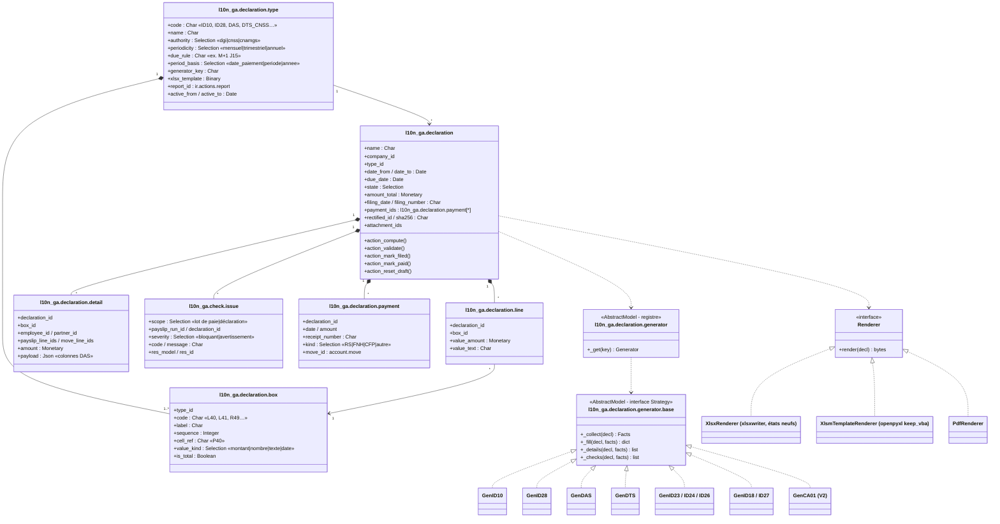

## 4. Séquence — calcul d'un bulletin

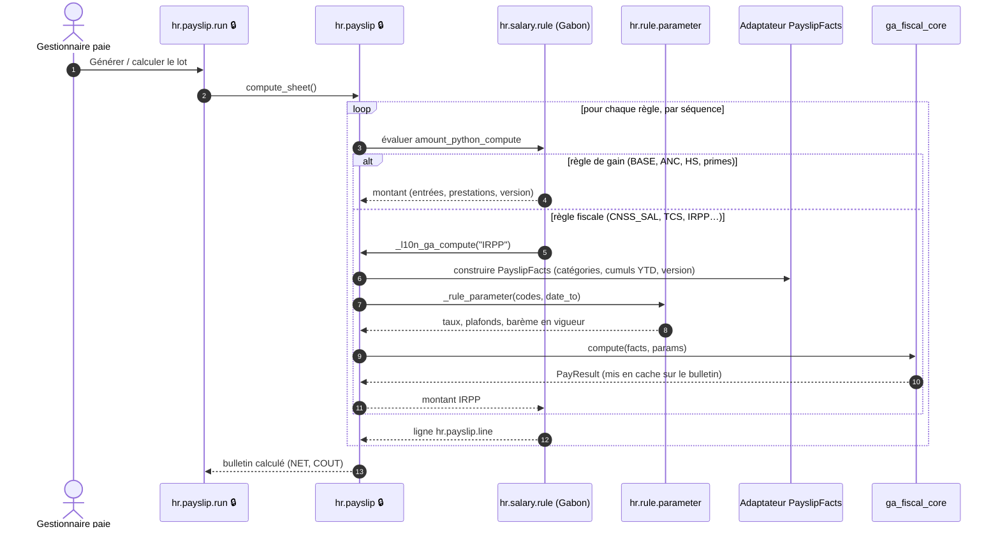

## 5. Séquence — clôture mensuelle et ID10

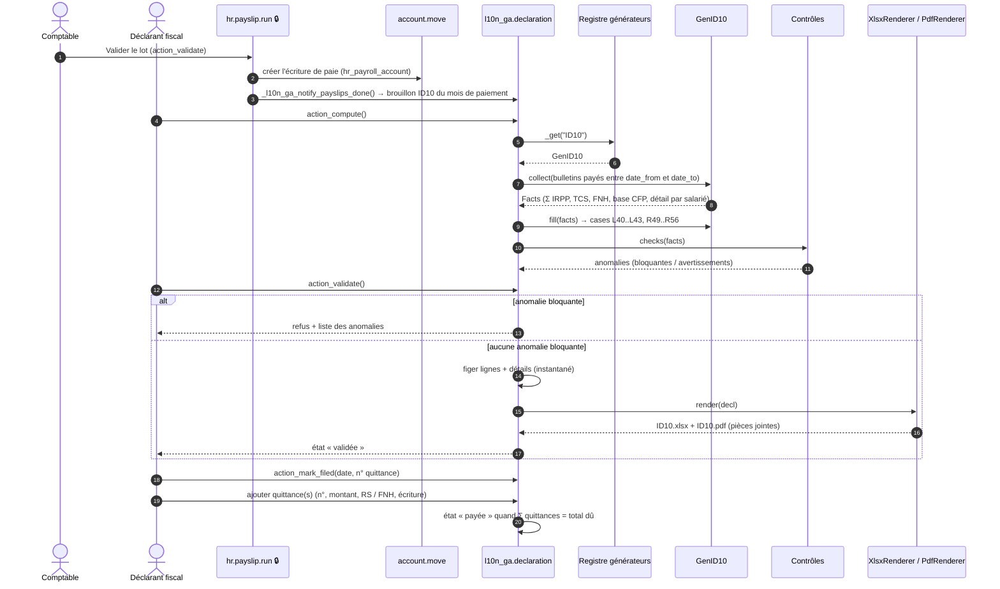

## 6. Séquence — DAS annuelle

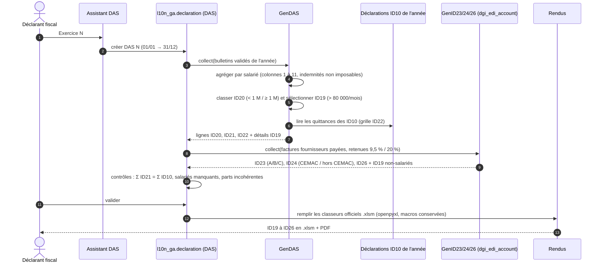

## 7. Séquence — import des variables mensuelles (F3)

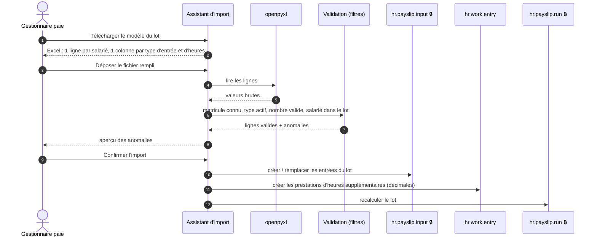

## 8. Séquence — bascule depuis hr_payroll_gb (F12)

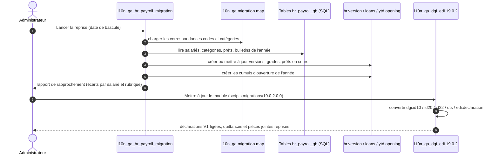

## 9. Diagramme d'états — prêt salarié (F1)

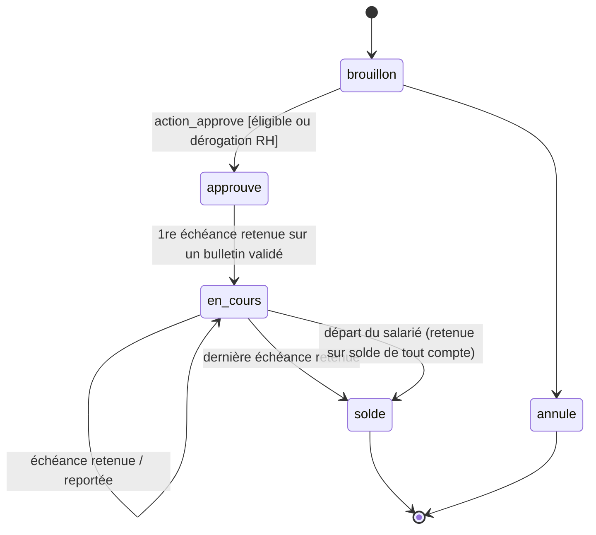

## 10. Diagramme d'états — déclaration

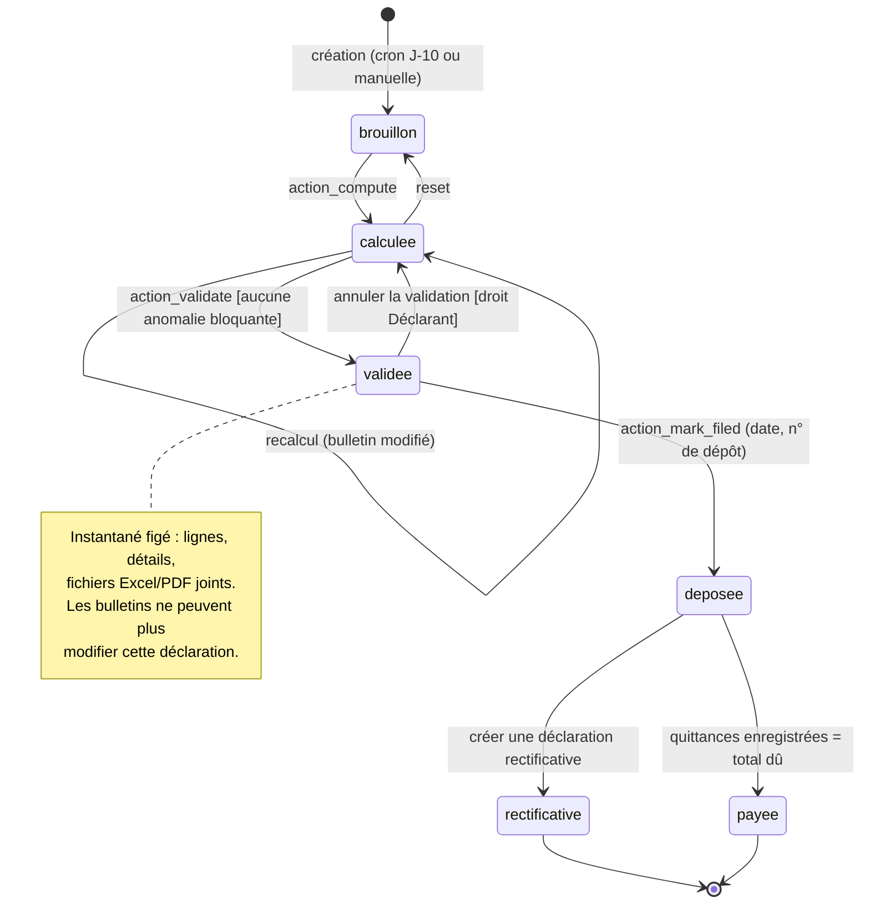

## 11. Diagramme d'activités — calcul fiscal d'un bulletin (noyau)

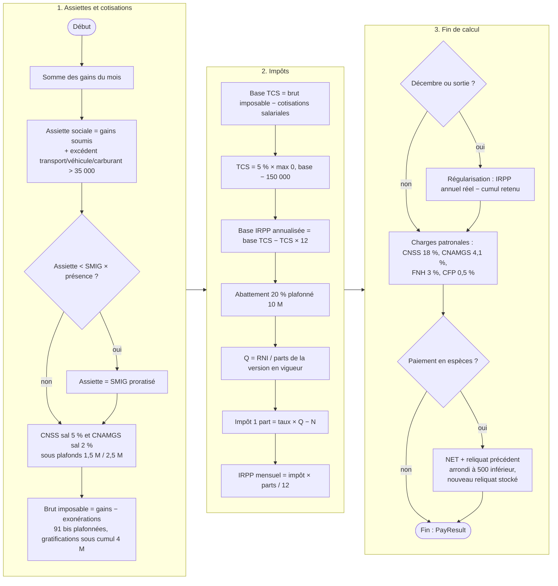
