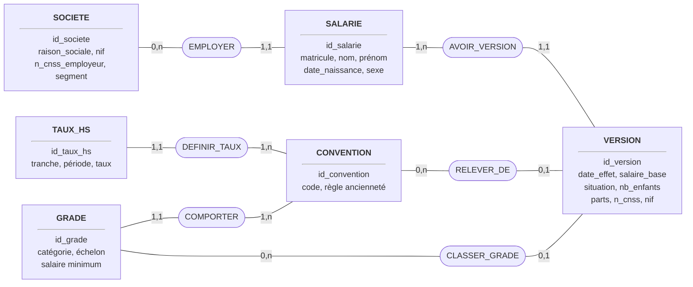
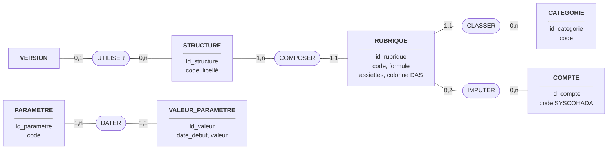
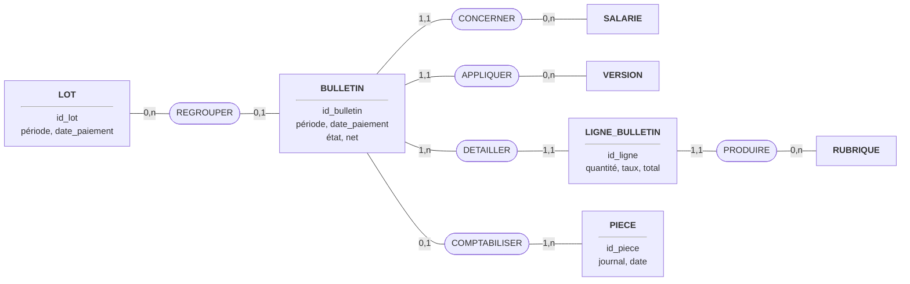
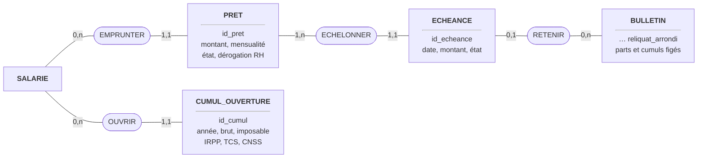
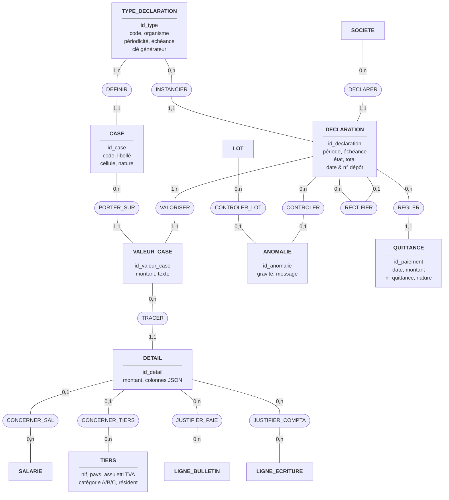
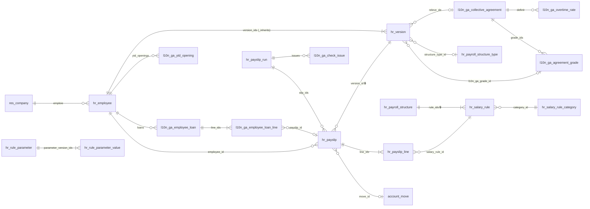
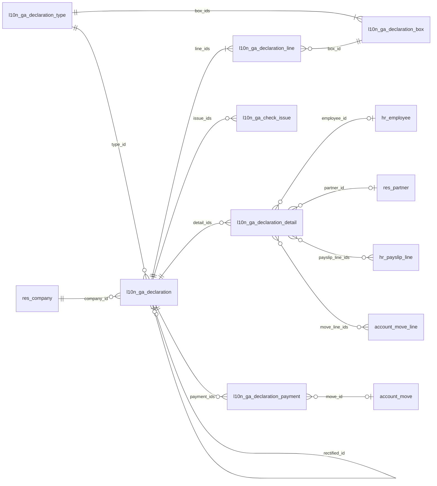

# 03 — Modèle de données (Merise : MCD, MLD, MPD Odoo)

## 1. Règles de gestion

| N° | Règle |
|---|---|
| RG01 | Une société emploie zéro ou plusieurs salariés ; un salarié appartient à une et une seule société. |
| RG02 | Un salarié possède au moins une version ; chaque version est datée (date d'effet) et porte les données susceptibles de changer : salaire, situation familiale, enfants, parts fiscales, convention. La version applicable à une date est la plus récente dont la date d'effet est antérieure ou égale. |
| RG03 | Le nombre de parts est calculé à partir de la situation et des enfants de la version ; il peut être forcé avec justification. |
| RG04 | Une version relève d'au plus une convention collective ; une convention définit ses taux d'heures supplémentaires et sa règle d'ancienneté. |
| RG05 | Une structure salariale regroupe une ou plusieurs rubriques ; une rubrique appartient à une seule structure et à une seule catégorie. |
| RG06 | Un paramètre fiscal (code) possède une ou plusieurs valeurs datées ; la valeur applicable est la dernière dont la date de début est antérieure ou égale à la date de fin de période du bulletin. |
| RG07 | Un bulletin concerne un salarié, une version et une période ; il appartient à au plus un lot. Il porte une date de paiement. |
| RG08 | Un bulletin comporte une ou plusieurs lignes ; chaque ligne est produite par une rubrique. |
| RG09 | Un bulletin validé génère au plus une pièce comptable ; une pièce peut regrouper les bulletins d'un lot. |
| RG10 | Un type de déclaration (imprimé) définit une ou plusieurs cases ; une case appartient à un seul type. |
| RG11 | Une déclaration est d'un seul type, pour une société et une période ; il ne peut exister qu'une déclaration non rectificative par (société, type, période). |
| RG12 | Une déclaration valorise ses cases : une valeur par case et par déclaration. |
| RG13 | Chaque valeur de case est justifiée par zéro ou plusieurs lignes de détail ; un détail concerne un salarié ou un tiers et référence les lignes de bulletin ou d'écriture qui le composent. |
| RG14 | Une déclaration validée est figée : ses valeurs et détails ne sont plus recalculés. Une correction passe par une déclaration rectificative liée à l'originale. |
| RG15 | Une déclaration peut faire l'objet de zéro ou plusieurs anomalies de contrôle ; elle ne peut être validée s'il reste une anomalie bloquante. |
| RG16 | Une déclaration est réglée par zéro, un ou plusieurs paiements (quittances) ; elle est « payée » quand la somme des quittances égale le total dû. *(modifié après benchmark : la V1 gère deux quittances par ID10)* |
| RG17 | Une rubrique est imputée à au plus un compte de débit et au plus un compte de crédit. |
| RG18 | Une convention définit une ou plusieurs grades (catégorie, échelon) ; une version relève d'au plus un grade ; le salaire de la version ne peut être inférieur au minimum du grade à sa date (contrôle bloquant). |
| RG19 | Un salarié peut avoir zéro ou plusieurs prêts ; un prêt concerne un seul salarié et comporte une ou plusieurs échéances. |
| RG20 | Un prêt n'est approuvé que si le salarié a au moins 2 ans d'ancienneté, que la mensualité ne dépasse pas 40 % du net et que l'encours reste sous le plafond société, sauf dérogation RH motivée. |
| RG21 | Une échéance est retenue par au plus un bulletin ; un bulletin retient zéro ou plusieurs échéances. |
| RG22 | Un code de rubrique est unique dans une structure. |
| RG23 | Chaque version porte un mode de paiement (virement, espèces, chèque). Un bulletin payé en espèces arrondit le net à payer au multiple de l'arrondi société inférieur et stocke le reliquat, repris par le bulletin suivant du même salarié. |
| RG24 | À la validation, un bulletin fige les valeurs qu'il imprime (parts, plafonds, bases, cumuls annuels) ; le bulletin imprimé et la DAS lisent ces valeurs. |
| RG25 | Un salarié a au plus un cumul d'ouverture par année ; il complète les cumuls des bulletins de l'année pour la régularisation IRPP, le plafond des gratifications et la DAS. |
| RG26 | Une anomalie de contrôle concerne soit un lot de paie, soit une déclaration ; un lot ne peut être calculé s'il reste une anomalie bloquante. |
| RG27 | Un tiers (bénéficiaire) est classé A, B ou C pour l'ID23, résident ou non, zone CEMAC ou hors CEMAC ; un non-résident ne subit que la retenue de 20 %. |

## 2. Dictionnaire de données (extrait des attributs métier)

| Entité | Identifiant | Attributs principaux |
|---|---|---|
| SOCIETE | id_societe | raison_sociale, nif, n_cnss_employeur, n_cnamgs, code_centre_impots, segment (DGE/CIME/autre), option_cfp_id28, part_fnh_salarie |
| SALARIE | id_salarie | matricule, nom, prenom, date_naissance, sexe, date_embauche |
| VERSION | id_version | date_effet, salaire_base, situation_familiale, nb_enfants, nb_enfants_infirmes, demi_part_speciale, parts_calculees, parts_forcees, n_cnss, n_cnamgs, nif, code_nationalite, code_emploi, code_niveau, trajets_transport, vehicule_fonction, mode_paiement |
| CONVENTION | id_convention | code, libelle, anciennete_debut, taux_debut, pas_annuel, taux_max |
| TAUX_HS | id_taux_hs | tranche_debut, tranche_fin, periode (jour/nuit/dimanche/férié), taux |
| STRUCTURE | id_structure | code, libelle |
| CATEGORIE | id_categorie | code (BASIC, ALW, GROSS, DED, COMP, NET…), libelle |
| RUBRIQUE | id_rubrique | code, libelle, sequence, formule, assiette_sociale, assiette_fiscale, param_plafond, base_conges, base_rupture, colonne_das |
| PARAMETRE | id_parametre | code, libelle |
| VALEUR_PARAMETRE | id_valeur | date_debut, valeur (nombre, liste ou barème JSON) |
| LOT | id_lot | libelle, date_debut, date_fin, date_paiement, etat |
| BULLETIN | id_bulletin | reference, date_debut, date_fin, date_paiement, etat, net, cout_employeur, parts_utilisees, bases et plafonds figés, cumuls annuels figés, reliquat_arrondi |
| LIGNE_BULLETIN | id_ligne | code, quantite, taux, montant, total |
| PIECE | id_piece | journal, date, reference |
| COMPTE | id_compte | code SYSCOHADA, libelle |
| TYPE_DECLARATION | id_type | code (ID10…), organisme, periodicite, regle_echeance, base_periode, cle_generateur, modele_excel, date_debut, date_fin |
| CASE | id_case | code, libelle, sequence, reference_cellule, nature_valeur, est_total |
| DECLARATION | id_declaration | periode_debut, periode_fin, date_echeance, etat, montant_total, date_depot, n_depot, rectificative_de |
| VALEUR_CASE | id_valeur_case | montant, texte |
| DETAIL | id_detail | montant, donnees_colonnes (JSON) |
| ANOMALIE | id_anomalie | perimetre (lot / déclaration), gravite, code, message |
| PAIEMENT (QUITTANCE) | id_paiement | date, montant, n_quittance, nature (RS / FNH / CFP / autre) |
| TIERS | id_tiers | nom, nif, pays, assujetti_tva, categorie_honoraires (A/B/C), resident, zone (CEMAC / hors CEMAC) |
| GRADE | id_grade | categorie, echelon, salaire_minimum, taux_horaire, date_effet |
| PRET | id_pret | montant, date_octroi, nb_echeances, mensualite, etat, derogation_rh, motif |
| ECHEANCE | id_echeance | date, montant, etat (à payer / retenue / reportée) |
| CUMUL_OUVERTURE | id_cumul | annee, brut, imposable, irpp, tcs, cnss, gratifications_exonerees, periode_couverte |

## 3. MCD — domaine paie

Notation Merise : entités en rectangles, associations en ovales, cardinalités (min,max) côté entité. Le domaine paie est présenté en quatre vues pour rester lisible.

### 3.1 Vue « salarié » : société, salarié, version, convention

### 3.2 Vue « rubriques et paramètres »

### 3.3 Vue « bulletins » : lot, bulletin, lignes, comptabilisation

### 3.4 Vue « prêts, cumuls et paiement » (ajoutée après le benchmark)

## 4. MCD — domaine déclarations

## 5. MLD (modèle logique relationnel)

Clés primaires soulignées dans le texte par `PK`, clés étrangères par `#`.

| Relation | Attributs |
|---|---|
| SOCIETE | id_societe PK, raison_sociale, nif, n_cnss_employeur, n_cnamgs, code_centre_impots, segment, option_cfp_id28, part_fnh_salarie |
| SALARIE | id_salarie PK, matricule, nom, prenom, date_naissance, sexe, date_embauche, #id_societe, #id_version_courante |
| CONVENTION | id_convention PK, code, libelle, anciennete_debut, taux_debut, pas_annuel, taux_max |
| TAUX_HS | id_taux_hs PK, tranche_debut, tranche_fin, periode, taux, #id_convention |
| STRUCTURE | id_structure PK, code, libelle |
| VERSION | id_version PK, date_effet, salaire_base, situation, nb_enfants, nb_enfants_infirmes, demi_part_speciale, parts_calculees, parts_forcees, n_cnss, n_cnamgs, nif, code_nationalite, code_emploi, code_niveau, trajets, vehicule_fonction, mode_paiement, #id_salarie, #id_convention, #id_grade, #id_structure |
| GRADE | id_grade PK, categorie, echelon, salaire_minimum, taux_horaire, date_effet, #id_convention |
| CATEGORIE | id_categorie PK, code, libelle |
| RUBRIQUE | id_rubrique PK, code, libelle, sequence, formule, assiette_sociale, assiette_fiscale, param_plafond, base_conges, base_rupture, colonne_das, #id_structure, #id_categorie, #id_compte_debit, #id_compte_credit — unique (id_structure, code) |
| PARAMETRE | id_parametre PK, code, libelle |
| VALEUR_PARAMETRE | id_valeur PK, date_debut, valeur, #id_parametre |
| LOT | id_lot PK, libelle, date_debut, date_fin, date_paiement, etat |
| BULLETIN | id_bulletin PK, reference, date_debut, date_fin, date_paiement, etat, net, cout_employeur, parts_utilisees, bases_figees, cumuls_figes, reliquat_arrondi, #id_salarie, #id_version, #id_lot, #id_piece |
| PRET | id_pret PK, montant, date_octroi, nb_echeances, mensualite, etat, derogation_rh, motif, #id_salarie, #id_societe |
| ECHEANCE | id_echeance PK, date, montant, etat, #id_pret, #id_bulletin |
| CUMUL_OUVERTURE | id_cumul PK, annee, brut, imposable, irpp, tcs, cnss, gratifications_exonerees, #id_salarie — unique (id_salarie, annee) |
| LIGNE_BULLETIN | id_ligne PK, code, quantite, taux, montant, total, #id_bulletin, #id_rubrique |
| PIECE | id_piece PK, journal, date, reference |
| COMPTE | id_compte PK, code, libelle |
| TYPE_DECLARATION | id_type PK, code, organisme, periodicite, regle_echeance, base_periode, cle_generateur, modele_excel, date_debut, date_fin |
| CASE_DECL | id_case PK, code, libelle, sequence, reference_cellule, nature_valeur, est_total, #id_type |
| DECLARATION | id_declaration PK, periode_debut, periode_fin, date_echeance, etat, montant_total, date_depot, n_depot, #id_societe, #id_type, #id_rectifiee |
| VALEUR_CASE | id_valeur_case PK, montant, texte, #id_declaration, #id_case — unique (id_declaration, id_case) |
| DETAIL | id_detail PK, montant, colonnes_json, #id_valeur_case, #id_salarie, #id_tiers |
| JUSTIFIER_PAIE | #id_detail, #id_ligne — PK composée |
| JUSTIFIER_COMPTA | #id_detail, #id_ligne_ecriture — PK composée |
| ANOMALIE | id_anomalie PK, perimetre, gravite, code, message, #id_declaration, #id_lot |
| QUITTANCE | id_paiement PK, date, montant, n_quittance, nature, #id_declaration, #id_piece |
| TIERS | id_tiers PK, nom, nif, pays, assujetti_tva, categorie_honoraires, resident, zone |

## 6. MPD — correspondance avec les modèles Odoo 19

### 6.1 Paie

### 6.2 Déclarations

| Entité Merise | Modèle Odoo | Statut |
|---|---|---|
| SOCIETE | `res.company` | existant, étendu |
| SALARIE | `hr.employee` | existant (hérite par délégation de `hr.version`) |
| VERSION | `hr.version` | existant (Odoo 19), étendu |
| CONVENTION / TAUX_HS | `l10n_ga.collective.agreement` / `l10n_ga.overtime.rate` | nouveaux |
| STRUCTURE / CATEGORIE / RUBRIQUE | `hr.payroll.structure` / `hr.salary.rule.category` / `hr.salary.rule` | existants 🔒, rubrique étendue |
| PARAMETRE / VALEUR | `hr.rule.parameter` / `hr.rule.parameter.value` | existants 🔒, données Gabon |
| LOT / BULLETIN / LIGNE | `hr.payslip.run` / `hr.payslip` / `hr.payslip.line` | existants 🔒, bulletin étendu |
| PIECE / LIGNE_ECRITURE / COMPTE | `account.move` / `account.move.line` / `account.account` | existants |
| TIERS | `res.partner` | existant, étendu dès la V1 (catégorie A/B/C, résident, zone, assujetti TVA) |
| GRADE | `l10n_ga.agreement.grade` | nouveau (F5) |
| PRET / ECHEANCE | `l10n_ga.employee.loan` / `l10n_ga.employee.loan.line` | nouveaux (F1) |
| CUMUL_OUVERTURE | `l10n_ga.ytd.opening` | nouveau (F12) |
| TYPE_DECLARATION / CASE | `l10n_ga.declaration.type` / `l10n_ga.declaration.box` | nouveaux (données XML) |
| DECLARATION / VALEUR_CASE / DETAIL | `l10n_ga.declaration` / `.line` / `.detail` | nouveaux |
| ANOMALIE | `l10n_ga.check.issue` (lot de paie ou déclaration) | nouveau, généralisé (F8) |
| QUITTANCE | `l10n_ga.declaration.payment` | nouveau (F11), cardinalité (0,n) |
| Associations n-n JUSTIFIER | `Many2many` `payslip_line_ids`, `move_line_ids` | tables de relation générées par l'ORM |

Contraintes SQL à déclarer (`models.Constraint` en Odoo 19) : unicité (société, type, date_from, date_to) hors rectificatives ; unicité (declaration_id, box_id) sur les lignes ; `date_to >= date_from` ; parts forcées entre 1 et 6,5 ; unicité (employee_id, year) sur les cumuls d'ouverture ; montant de prêt et mensualité strictement positifs. L'unicité du code de rubrique par structure (RG22) est portée par un test, la table des règles étant Enterprise 🔒.
