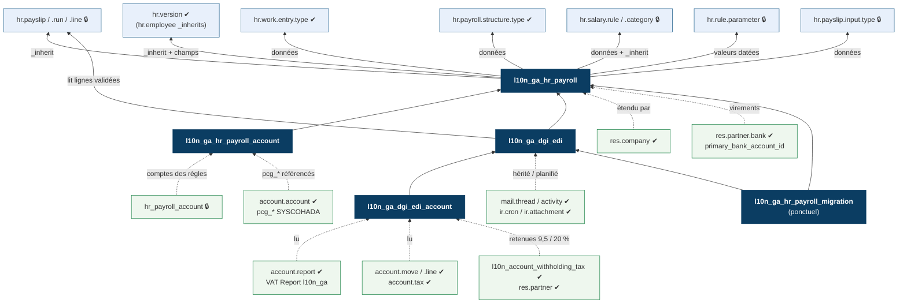

# 05 — Intégration avec les addons Odoo 19

Chaque ligne indique le point d'extension exact et sa vérification. ✔ = vérifié dans le code source Odoo 19.0 Community (clone du 23/09/2026) ; 🔒 = Enterprise (dépôt privé), à confirmer en ouvrant le code du module sur l'instance du client.

## 1. Carte d'intégration



Légende (v1.1 : ajout de la reprise, des retenues fournisseurs et des comptes bancaires) : bleu clair (en haut) = Odoo RH et paie, étendus par les addons Gabon (flèches pleines) ; bleu foncé = addons Gabon, reliés par leurs dépendances ; vert (en bas) = Odoo comptabilité et technique, dont les données sont lues ou étendues (flèches pointillées).

## 2. Module `l10n_ga_hr_payroll`

### 2.1 Manifeste

```python
{
    'name': 'Gabon - Paie',
    'countries': ['ga'],
    'category': 'Human Resources/Payroll',
    'depends': ['hr_payroll', 'l10n_ga'],            # 🔒 hr_payroll
    'data': [
        'security/ir.model.access.csv',
        'security/l10n_ga_hr_payroll_security.xml',
        'data/hr_payroll_structure_type_data.xml',
        'data/hr_salary_rule_category_data.xml',
        'data/hr_payroll_structure_data.xml',
        'data/hr_salary_rule_data.xml',
        'data/hr_rule_parameters_data.xml',          # généré depuis le YAML
        'data/hr_payslip_input_type_data.xml',
        'data/hr_work_entry_type_data.xml',
        'data/l10n_ga_collective_agreement_data.xml',
        'data/l10n_ga_agreement_grade_data.xml',      # F5 grille conventionnelle
        'data/hr_leave_type_data.xml',                # F4 12 types d'absence
        'data/ir_sequence_data.xml',                  # prêts
        'views/hr_version_views.xml',
        'views/res_company_views.xml',
        'views/l10n_ga_collective_agreement_views.xml',
        'views/l10n_ga_employee_loan_views.xml',      # F1
        'views/hr_payslip_run_views.xml',             # F8 anomalies, F2 billetage
        'wizard/l10n_ga_payslip_input_import_views.xml',  # F3
        'report/report_payslip_ga.xml',
        'report/report_payroll_book.xml',             # F13
        'report/report_cash_breakdown.xml',           # F2 billetage
    ],
    'external_dependencies': {'python': ['openpyxl', 'xlsxwriter']},  # déjà requis par Odoo 19 ✔
    'license': 'OPL-1',
}
```

Le catalogue des rubriques (F6) est tenu dans `data/catalogue_rubriques_ga.csv` et converti en XML par le même script de build que les paramètres ; un test vérifie l'unicité des codes de règles par structure.

### 2.2 Extensions de modèles

| Modèle Odoo | Mécanisme | Ajout Gabon | Vérification |
|---|---|---|---|
| `hr.version` | `_inherit = 'hr.version'` (même mécanisme que `hr_work_entry/models/hr_version.py`) | `l10n_ga_disabled_children`, `l10n_ga_extra_half_part`, `l10n_ga_tax_parts` (calculé, stocké), `l10n_ga_tax_parts_forced`, `l10n_ga_cnamgs_number`, `l10n_ga_nif`, `l10n_ga_nationality_code` (calculé depuis `country_id`), `l10n_ga_job_code`, `l10n_ga_level_code`, `l10n_ga_transport_trips`, `l10n_ga_company_car`, `l10n_ga_agreement_id`, `l10n_ga_grade_id` (F5), `l10n_ga_payment_mode` (virement, chèque, espèces — F2) | ✔ `hr.employee` a `_inherits = {'hr.version': 'version_id'}` (hr_employee.py l.45) ; `marital`, `children`, `ssnid`, `sex`, `country_id` sont sur `hr.version` |
| `hr.employee` | aucun champ stocké ajouté | les champs de version sont exposés automatiquement ; pour ceux qui portent un `groups`, déclarer un related `inherited=True` comme le fait le standard (commentaire hr_employee.py l.180) | ✔ |
| `hr.employee` | méthode | `employee._get_version(date)` pour la version applicable (DAS, régularisation) | ✔ hr_employee.py l.559 |
| `res.company` | `_inherit` | NIF, n° employeur CNSS et CNAMGS, code centre des impôts, segment DGE/CIME, option CFP sur ID28, part salariale FNH, `l10n_ga_cash_rounding` (500 par défaut), plafond d'encours des prêts | ✔ modèle standard |
| `hr.employee` | lecture | `primary_bank_account_id` pour l'état des virements par banque (F2) ; contrôle « compte bancaire manquant » si mode virement | ✔ champ standard 19 |
| `hr.leave.type` / `hr.work.entry.type` | données XML | 12 absences gabonaises (F4) : congé payé, maladie, maternité, AT, événements familiaux, absence non rémunérée… ; la règle `BASIC` est proratisée par les prestations (`worked_days`), jamais par une retenue ajoutée | ✔ (`hr_work_entry_holidays`) |
| `hr.payroll.structure.type` | donnée XML | type « Gabon : Employé » (`country_id` = Gabon) | ✔ défini dans le module `hr` (hr_payroll_structure_type.py) |
| `hr.work.entry.type` | donnée XML | codes `GA_HS_J`, `GA_HS_N`, `GA_HS_DIM`, `GA_HS_FER`, `GA_MAT` (maternité subrogée), `GA_AT`… avec `country_id` Gabon | ✔ champs `code`, `country_id`, `is_extra_hours`, `amount_rate` |
| `hr.payroll.structure` / `hr.salary.rule.category` / `hr.salary.rule` | données XML + `_inherit` sur la règle | structure « Gabon — Employé », catégories `GA_SOC_EXCL`, `GA_TAX_EXEMPT`, `GA_EMPLOYER`… ; champs de fiscalité sur la règle (fichier 02 §2) | 🔒 |
| `hr.rule.parameter` | données XML | `l10n_ga_cnss_employee_rate`, `l10n_ga_cnss_ceiling`, `l10n_ga_irpp_brackets`, `l10n_ga_fnh_rate`… avec valeurs datées | 🔒 |
| `hr.payslip.input.type` | données XML | primes variables, avances, gratifications, rappel, régularisation | 🔒 |
| `hr.payslip` | `_inherit` | `l10n_ga_payment_date`, `_l10n_ga_facts(categories)`, `_l10n_ga_params()`, `_l10n_ga_compute(code, categories)` (cache du `PayResult` par bulletin), cumuls annuels ; champs figés (F7) : `l10n_ga_tax_parts_used`, plafonds et bases appliqués, `l10n_ga_ytd_gross`, `l10n_ga_ytd_irpp` ; `l10n_ga_rounding_carry` (F2) | 🔒 nom du lien vers la version (`version_id` attendu en 19) |
| `hr.payslip.input` | création par l'assistant d'import (F3) et par les échéances de prêt (F1, entrée `GA_LOAN`) | écrit dans les entrées standard du bulletin, pas sur la fiche salarié | 🔒 |
| nouveaux modèles | `_name` | `l10n_ga.agreement.grade`, `l10n_ga.employee.loan` (+ `.line`, `mail.thread`), `l10n_ga.payslip.input.import` (transient), `l10n_ga.ytd.opening` | ✔ ORM standard |
| `hr.leave.type` | donnée | associer les congés Gabon (congés payés, maternité, AT, événements familiaux) à leurs types de prestation | ✔ via `hr_work_entry_holidays` (module de données) |

### 2.3 Vues

| Vue héritée | xml_id | Point d'insertion | Vérification |
|---|---|---|---|
| Fiche salarié | `hr.view_employee_form` | groupe `hr_family_group` (après `children`) : enfants infirmes, demi-part, parts calculées/forcées | ✔ l.312-320 |
| Fiche salarié | `hr.view_employee_form` | page `payroll_information` (après `structure_type_id`) : n° CNAMGS, NIF, convention, codes emploi/niveau, trajets, véhicule de fonction | ✔ page l.327 |
| Société | `base.view_company_form` | onglet « Gabon — Paie et fiscalité » | ✔ |
| Règle salariale | vue formulaire `hr_payroll` 🔒 | bloc « Fiscalité Gabon » | 🔒 |

Syntaxe Odoo 19 : attributs `invisible="..."`, `readonly="..."` directement (plus d'`attrs`), listes `<list>`.

### 2.4 Règles salariales : liaison avec le noyau

Chaque règle fiscale ne contient qu'une ligne ; la logique est dans le noyau.

```python
# amount_python_compute de la règle IRPP (🔒 variables disponibles : payslip, categories, inputs, worked_days...)
result = -payslip._l10n_ga_compute('irpp', categories)
```

| Code | Catégorie | Calcul | Compte (module account) |
|---|---|---|---|
| `BASIC`, `GA_ANC`, `GA_HS_*`, primes | Base / Indemnités | standard + taux convention | `pcg_6611`, `pcg_6612`, `pcg_6631` à `pcg_6638` |
| `GROSS` | Brut | somme | — |
| `GA_CNSS_SAL`, `GA_CNAMGS_SAL` | Retenues | noyau | crédit `pcg_4313` / `pcg_4318` |
| `GA_TCS`, `GA_IRPP`, `GA_IRPP_REGUL` | Retenues | noyau | crédit `pcg_4472` / `pcg_4471` |
| `NET` | Net (unique, quel que soit le mode de paiement) | standard | crédit `pcg_422` |
| `GA_LOAN` | Retenue | entrée de bulletin générée par l'échéance du prêt | crédit `pcg_4211` (avances et prêts au personnel) |
| `GA_ROUND_PREV`, `GA_ROUND`, `GA_NET_PAY` | Arrondi espèces (F2) | reliquat du bulletin précédent + arrondi au multiple de `l10n_ga_cash_rounding` ; `GA_NET_PAY` = montant versé | sans écriture propre : le reliquat reste dans `pcg_422` |
| `GA_CNSS_PF`, `GA_CNSS_AT`, `GA_CNSS_AVID`, `GA_CNAMGS_PAT` | Charges patronales | noyau | débit `pcg_6641`, crédit `pcg_4311`, `pcg_4312`, `pcg_4313`, `pcg_4318` |
| `GA_FNH`, `GA_CFP` | Charges patronales | noyau | débit `pcg_6413` / `pcg_6415`, crédit `pcg_4472` |

## 3. Module `l10n_ga_hr_payroll_account`

- `depends`: `['l10n_ga_hr_payroll', 'hr_payroll_account']` 🔒, `auto_install: True`.
- Données : écrit `account_debit` / `account_credit` 🔒 sur les règles, en référençant les comptes créés par le modèle de plan `l10n_syscohada` : xml_id de gabarit `pcg_422`, `pcg_4311`, `pcg_4312`, `pcg_4313`, `pcg_4318`, `pcg_4471`, `pcg_4472`, `pcg_6413`, `pcg_6415`, `pcg_6611` à `pcg_6618`, `pcg_6631` à `pcg_6638`, `pcg_6641`, `pcg_6642`, `pcg_4211` (avances) ✔ (fichier `l10n_syscohada/data/template/account.account-syscohada.csv`).
- Les comptes étant créés par société au chargement du plan, la liaison se fait par code (`account.account` filtré sur `company_id` et `code`) dans un hook post-installation ou via `env['account.chart.template'].ref('pcg_422')` pour la société courante (méthode `ref(xmlid)` ✔ `account/models/chart_template.py` l.1232, à appeler avec `with_company(société)`).
- Rapprochements : solde 447x ↔ ID10 payée ; solde 431x ↔ DTS payée.

## 4. Module `l10n_ga_dgi_edi`

| Élément | Intégration |
|---|---|
| `l10n_ga.declaration` | `_inherit = ['mail.thread', 'mail.activity.mixin']` ✔ : historique des états, activités d'échéance, pièces jointes (`ir.attachment`) |
| Lecture des bulletins | `hr.payslip.line._read_group(...)` ✔ (API `_read_group(domain, groupby, aggregates)`), filtre sur `l10n_ga_payment_date` et l'état validé 🔒 |
| Événement fin de lot | surcharge de la méthode de validation de `hr.payslip.run` 🔒 |
| Échéancier | `ir.cron` quotidien ✔ |
| Rendus | `ir.actions.report` QWeb ✔ ; `openpyxl` (`keep_vba=True`) pour remplir les classeurs officiels `.xlsm` de la DGI (F10) et `xlsxwriter` pour les états neufs — les deux sont dans `requirements.txt` d'Odoo 19 ✔ |
| Sécurité | groupes `l10n_ga_dgi_edi.group_declarant` (implique `hr_payroll.group_hr_payroll_user` 🔒) et « Responsable » ; règle multi-société `company_id in company_ids` |
| Contraintes | `models.Constraint('unique (company_id, type_id, date_from, date_to, rectified_id)', ...)` ✔ syntaxe 19 (ex. hr_employee.py l.246) |
| Quittances (F11) | `l10n_ga.declaration.payment` (One2many `payment_ids`, plusieurs par déclaration) ; la déclaration passe à « payée » quand la somme des quittances couvre le total ; la grille ID22 de la DAS les reprend | ✔ ORM standard |
| Anomalies (F8) | `l10n_ga.check.issue` (périmètre lot de paie ou déclaration), remplace le modèle d'anomalies de la V1 ; vue liste partagée « Contrôle DAS » / « Anomalies de paie » | ✔ |
| Continuité V1 (ADR-12) | le nom technique `l10n_ga_dgi_edi` est conservé ; `migrations/19.0.2.0.0/pre-migrate.py` renomme les tables et colonnes de la V1, `post-migrate.py` recalcule les empreintes SHA-256 et rattache les quittances existantes | ✔ mécanisme standard `migrations/<version>/` |
| Données | `data/l10n_ga_declaration_type_data.xml` : types ID10, ID28, DAS (ID19 à ID26), DTS_CNSS, DTS_CNAMGS et leurs cases (cellule du gabarit), gabarits officiels `edi-annexe-ID19/21/23/26.xlsm` repris de la V1 en `static/templates/` |

## 5. Module `l10n_ga_dgi_edi_account` (partie V1.0 : ID18, ID27, ID23, ID24, ID26 ; partie V2.0 : le reste)

| Imprimé | Source Odoo réutilisée | Vérification |
|---|---|---|
| CA01 TVA + CSS | rapport `account.report` « VAT Report » de `l10n_ga` (lignes 1. opérations non imposables, 2. exportations, 3. opérations imposables à 18/10/5 %, 5a opérations avec l'État…) ; lire les montants du rapport pour la période au lieu de recalculer | ✔ `l10n_ga/data/account_tax_report_data.xml` |
| ID30 CSS | taxes `css_sale_1` (enfant des taxes groupées `tva_sale_19/11…` « 18 % TVA + 1 % CSS ») | ✔ `l10n_ga/data/template/account.tax-ga.csv` |
| ID18 / ID26 (9,5 %) — **V1.0** | taxe `l10n_ga_ras_095` (retenue fournisseur résident non assujetti TVA) portée par `l10n_account_withholding_tax` : retenue au paiement, balises de rapport ; bénéficiaires classés par `l10n_ga_fee_category` | ✔ module présent en 19.0 (dépendance du module) |
| ID27 / ID24 (non-résidents 20 %) — **V1.0** | taxe `l10n_ga_ras_20`, appliquée si `l10n_ga_is_resident = False` sur le partenaire | ✔ |
| Champs `res.partner` | `l10n_ga_fee_category` (honoraires, commissions, loyers, prestations…), `l10n_ga_is_resident`, `l10n_ga_zone`, `l10n_ga_vat_subject` ; position fiscale automatique selon résidence et assujettissement | ✔ `_inherit` standard |
| ID23 honoraires — **V1.0** | lignes de factures fournisseurs des partenaires classés, cumulées sur l'année | — |
| ID09 / ID31 loyers | lignes sur comptes de loyers (622) + retenues | — |
| ID01 / ID02 / ID03 IS | résultat fiscal saisi ou issu du rapport, CA global (IMF) | — |
| FNE (facture électronique normalisée) | hors périmètre ; à traiter par un connecteur dédié homologué | — |

## 6. Module `l10n_ga_hr_payroll_migration` (ponctuel, F12)

```python
{
    'name': 'Gabon - Reprise depuis hr_payroll_gb',
    'depends': ['l10n_ga_hr_payroll', 'l10n_ga_dgi_edi'],   # jamais hr_payroll_gb
    'data': ['security/ir.model.access.csv', 'data/l10n_ga_migration_map_data.xml',
             'wizard/l10n_ga_migration_wizard_views.xml', 'report/report_migration_reconciliation.xml'],
    'license': 'OPL-1',
}
```

| Élément | Intégration |
|---|---|
| Lecture de la source | SQL en lecture seule sur les tables de `hr_payroll_gb` (présence testée par `information_schema`) ; aucun import Python du module |
| Table de correspondance | `l10n_ga.migration.map` : rubriques, types de congés, catégories, champs salarié → modèles V2 |
| Sorties | fiches salariés et versions complétées, grilles conventionnelles, prêts en cours avec échéancier restant, `l10n_ga.ytd.opening` (brut, bases, IRPP cumulés au jour de bascule) |
| Contrôle | état de rapprochement : pour le dernier mois payé avec le freelance, bulletin V2 recalculé à comparer ligne à ligne ; écarts listés avant désinstallation de `hr_payroll_gb` |
| Fin de vie | désinstallé après la bascule ; les cumuls d'ouverture restent (portés par `l10n_ga_hr_payroll`) |

## 7. Points à vérifier sur le code Enterprise avant de développer

1. Nom du lien bulletin → version (`version_id`) et suppression de `contract_id` dans `hr.payslip` 19.0.
2. Variables disponibles dans `amount_python_compute` (en particulier `payslip` : enregistrement réel ou objet navigable) et existence de `_rule_parameter`.
3. Nom de la méthode de validation d'un lot (`action_validate`) et des états de bulletin (`done`, `paid`).
4. Champs comptables des règles dans `hr_payroll_account` (`account_debit`, `account_credit`) et regroupement des écritures par lot.
5. Présence d'une localisation « générique » ou d'un rapport de paie Enterprise réutilisable pour la DAS (Payroll Reporting).
6. Existence d'un modèle de prêts ou d'avances dans `hr_payroll` 19 (pour ne pas dupliquer F1) et comportement de `hr.payslip.input` créées hors bulletin.
7. Comportement de `l10n_account_withholding_tax` avec les factures multi-paiements et les avoirs (base de l'ID18).
8. Schéma exact des tables de `hr_payroll_gb` sur la base du client (noms de colonnes) avant d'écrire la table de correspondance.
