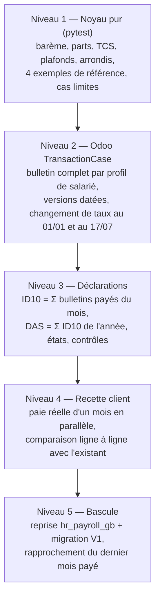
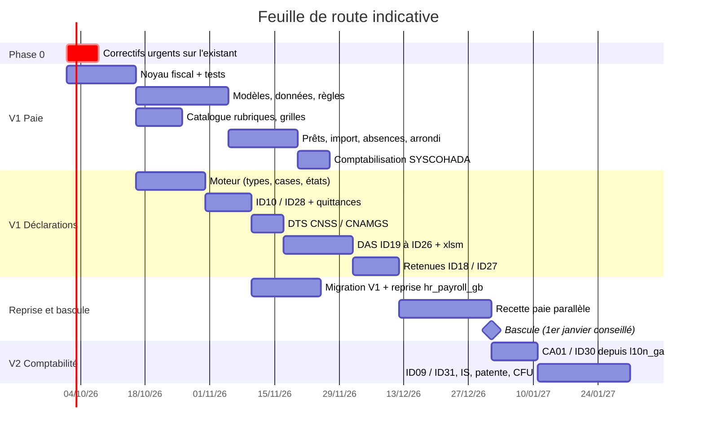

# 06 — Structure du code, tests et feuille de route

## 1. Arborescence du dépôt

```text
odoo-ga-payroll/                      (dépôt Git privé, ajouté aux addons_path)
├── l10n_ga_hr_payroll/
│   ├── __manifest__.py
│   ├── __init__.py
│   ├── lib/ga_fiscal_core/           ← noyau Python pur (aucun import odoo)
│   │   ├── __init__.py
│   │   ├── params.py                 FiscalParams, chargement YAML (tests)
│   │   ├── parts.py                  quotient familial
│   │   ├── social.py                 CNSS, CNAMGS, assiette, SMIG
│   │   ├── tax.py                    TCS, IRPP, abattement, barème, régularisation
│   │   ├── benefits.py               avantages en nature, exonérations art. 91/91 bis
│   │   ├── rounding.py               F2 arrondi espèces + reliquat
│   │   ├── cash_breakdown.py         F2 billetage
│   │   └── engine.py                 PayslipFacts → PayResult
│   ├── models/
│   │   ├── hr_version.py             champs Gabon + calcul des parts
│   │   ├── res_company.py
│   │   ├── hr_salary_rule.py         indicateurs d'assiette, colonne DAS
│   │   ├── hr_payslip.py             adaptateur, _l10n_ga_compute, cumuls
│   │   ├── hr_payslip_run.py         date de paiement du lot, contrôles avant paie (F8)
│   │   ├── l10n_ga_collective_agreement.py
│   │   ├── l10n_ga_agreement_grade.py        F5 grille (catégorie, échelon, minimum, taux horaire)
│   │   ├── l10n_ga_employee_loan.py          F1 prêt + échéances (Specification, State)
│   │   └── l10n_ga_ytd_opening.py            F12 cumuls d'ouverture de l'année
│   ├── wizard/l10n_ga_payslip_input_import.py  F3 import Excel (Pipes and Filters, openpyxl)
│   ├── data/                         structure, catégories, règles, paramètres, entrées, prestations,
│   │                                 12 absences (F4), grilles (F5), catalogue_rubriques_ga.csv (F6)
│   ├── report/ report_payslip_ga.xml       bulletin figé (F7 : lit les valeurs du bulletin)
│   │           report_payroll_book.xml     F13 livre de paie + état des charges (xlsxwriter)
│   │           report_bank_transfer.xml    F2 virements par banque, billetage
│   ├── views/ security/
│   ├── tools/yaml_to_rule_parameters.py   génère data/hr_rule_parameters_data.xml
│   ├── tools/csv_to_salary_rules.py       génère les règles depuis catalogue_rubriques_ga.csv
│   └── tests/
│       ├── test_core_engine.py       tests purs (exemples validés de la base de connaissance)
│       ├── test_tax_parts.py
│       ├── test_rounding.py          reliquat conservé sur 12 mois, solde de tout compte
│       ├── test_rule_codes_unique.py un code par structure, aucune règle ne redéfinit NET
│       ├── test_loan.py              octroi, dérogation, échéances, remboursement anticipé
│       ├── test_input_import.py      lignes rejetées, doublons, aperçu
│       ├── test_absences.py          proratisation par les prestations
│       └── test_payslip_ga.py        tests Odoo (TransactionCase) sur bulletins complets
├── l10n_ga_hr_payroll_account/
│   ├── __manifest__.py               auto_install
│   ├── data/hr_salary_rule_account_data.xml
│   └── tests/test_payroll_move.py
├── l10n_ga_dgi_edi/
│   ├── models/
│   │   ├── l10n_ga_declaration.py            Template Method + State + Snapshot
│   │   ├── l10n_ga_declaration_type.py
│   │   ├── l10n_ga_declaration_box.py
│   │   ├── l10n_ga_declaration_line.py / _detail.py / _check.py
│   │   ├── declaration_generator.py          Registry + interface Strategy
│   │   ├── generators/ id10.py id28.py das.py dts_cnss.py dts_cnamgs.py
│   │   ├── checks.py                         Chain of Responsibility
│   │   ├── hr_payslip_run.py                 Observer (fin de lot)
│   │   ├── l10n_ga_declaration_payment.py    F11 quittances (plusieurs par déclaration)
│   │   └── l10n_ga_check_issue.py            F8 anomalies (lot ou déclaration)
│   ├── renderers/ xlsx_builder.py            Builder (xlsxwriter, états neufs)
│   │              xlsm_template.py           Builder (openpyxl keep_vba, classeurs DGI — F10)
│   ├── report/ report_id10.xml report_id28.xml report_das_id19.xml report_das_id21.xml …
│   ├── static/templates/ ID10.xlsx ID28.xlsx edi-annexe-ID19/21/23/26.xlsm (repris de la V1)
│   ├── data/ l10n_ga_declaration_type_data.xml ir_cron_data.xml mail_activity_type_data.xml
│   ├── migrations/19.0.2.0.0/ pre-migrate.py post-migrate.py   continuité V1 (ADR-12)
│   ├── wizard/ l10n_ga_das_wizard.py
│   ├── views/ security/
│   └── tests/ test_id10.py test_das.py test_state_machine.py test_checks.py
│              test_payments.py test_xlsm_macros.py test_v1_ported.py (11 tests de la V1 portés)
├── l10n_ga_dgi_edi_account/          (V1.0 : ID18, ID27, ID23, ID24, ID26 ; V2.0 : le reste)
│   ├── models/res_partner.py                 catégorie d'honoraires, résidence, zone, assujetti TVA
│   ├── models/generators/ id18.py id27.py id23.py id24.py id26.py     ← V1.0
│   │                      ca01.py id30.py id09.py id31.py id01.py …   ← V2.0
│   ├── data/ account_tax_withholding_data.xml (l10n_ga_ras_095, l10n_ga_ras_20) l10n_ga_declaration_type_data.xml
│   └── tests/
└── l10n_ga_hr_payroll_migration/     (ponctuel, désinstallé après bascule — F12)
    ├── models/l10n_ga_migration_map.py       Data Mapper (table de correspondance)
    ├── wizard/l10n_ga_migration_wizard.py    lecture SQL de hr_payroll_gb, écriture V2
    ├── report/report_migration_reconciliation.xml
    └── tests/test_migration.py               base fictive aux tables hr_payroll_gb
```

## 2. Conventions

| Sujet | Règle |
|---|---|
| Nommage | champs et méthodes préfixés `l10n_ga_` sur les modèles standard ; nouveaux modèles `l10n_ga.*` ; codes de règles `GA_*` |
| Paramètres | codes `l10n_ga_<sujet>_<nature>` (`l10n_ga_cnss_employee_rate`) ; jamais de taux en dur, ni dans les règles, ni dans les générateurs |
| Arrondis | calculs en décimal, arrondi au franc (`float_round(..., precision_digits=0)`) à la ligne, jamais sur les totaux intermédiaires |
| Multi-société | `company_id` obligatoire sur les déclarations, `check_company=True` sur les Many2one, règles d'enregistrement |
| Langue | libellés en français (base) + fichier `i18n/fr.po` ; codes techniques en anglais |
| Qualité | `ruff`, `pylint-odoo`, couverture ≥ 90 % sur `ga_fiscal_core` |

## 3. Stratégie de tests



Jeux de tests prioritaires (v1.1 : ajout de paie en espèces avec reliquat sur 12 mois, prêt remboursé par anticipation, import avec lignes fausses, bascule en cours d'année avec cumuls d'ouverture, classeur `.xlsm` rouvert avec ses macros intactes) : célibataire sans enfant sous le seuil TCS ; marié 3 enfants au plafond CNSS ; cadre au plafond de l'abattement (≥ 4 166 667/mois) ; salarié entré le 15 du mois ; départ en cours d'année avec régularisation IRPP ; 13e mois dépassant le cumul de 4 000 000 ; changement de nombre d'enfants en cours d'année (nouvelle version) ; bulletin de décembre payé en janvier (ID10 de janvier).

## 4. Intégration continue

| Étape | Outil |
|---|---|
| Lint | `pre-commit` (ruff, pylint-odoo, xml lint) |
| Tests noyau | `pytest l10n_ga_hr_payroll/lib` (sans Odoo, < 1 s) |
| Tests Odoo | Odoo.sh ou runner Docker `odoo:19` Enterprise, `--test-tags /l10n_ga_hr_payroll,/l10n_ga_dgi_edi,/l10n_ga_dgi_edi_account,/l10n_ga_hr_payroll_migration` ; test de mise à jour depuis une base V1 anonymisée (`-u l10n_ga_dgi_edi`) |
| Sécurité | secrets hors dépôt, scan des dépendances ; revue de code obligatoire sur `lib/` et `data/hr_rule_parameters_data.xml` |
| Mise à jour de taux | PR dédiée « LF/LFR AAAA » : YAML + XML généré + test de non-régression daté |

## 5. Feuille de route



| Version | Périmètre | Critère de sortie |
|---|---|---|
| Phase 0 | Correctifs sur la production actuelle (défauts bloquants B1 à B3 du benchmark, dont le net absent en espèces et chèques) — sans attendre la V2 | paies du mois suivant justes |
| V1.0 | Paie Gabon complète (prêts, import, absences, grilles, arrondi espèces, livre de paie) + comptabilisation + ID10, ID28, DTS, DAS ID19 à ID26 avec retenues ID18/ID27 + reprise et migration | 1 mois de paie réelle identique à l'existant (écart ≤ 1 FCFA par ligne), ID10 accepté par le centre des impôts, rapprochement de bascule sans écart |
| V1.1 | Régularisation annuelle IRPP, solde de tout compte, allocation de rentrée | clôture d'exercice réussie |
| V2.0 | Déclarations issues de la comptabilité (CA01, ID30, loyers ID09/ID31, IS, patente, CFU) | CA01 identique au rapport TVA `l10n_ga` |

## 6. Risques et parades

| Risque | Parade |
|---|---|
| Structure de `hr_payroll` 19 différente de l'hypothèse | Couche d'adaptation unique (patron Adapter) ; vérifier les 8 points du fichier 05 §7 en sprint 0 |
| Changement de loi en cours d'année | Paramètres datés + PR dédiée + tests datés |
| Points fiscaux non tranchés (fichier 09 de la base) | Chaque point est un paramètre ou une option société, avec valeur par défaut documentée |
| Déclaration modifiée après dépôt | État figé + rectificative + empreinte SHA-256 |
| Reprise incomplète depuis `hr_payroll_gb` (codes non mappés, cumuls faux) | Table de correspondance explicite, anomalie pour tout code non mappé, rapprochement du dernier mois avant désinstallation ; bascule un 1er janvier de préférence |
| Macros des classeurs DGI perdues à l'écriture | `openpyxl` avec `keep_vba=True` + test qui rouvre le fichier et vérifie la présence du projet VBA |
| Double emploi avec un futur module de prêts d'Odoo | Point 6 du fichier 05 §7 vérifié en sprint 0 |
| Performance sur gros effectifs (DAS de plusieurs milliers de salariés) | `_read_group` en SQL, génération Excel en flux (`xlsxwriter` `constant_memory`), traitement en job cron si > 2 000 salariés |
